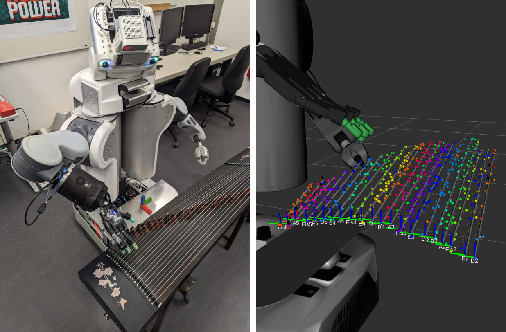

# Pluck and Play: Chordophone Exploration



## Video

[Watch the 3-minute pitch video here](https://youtu.be/AE36-gKiG40)

## Publication

To refer to this work, please cite the following paper:

```
@INPROCEEDINGS{goerner24,
	author={Görner, Michael and Hendrich, Norman and Zhang, Jianwei},
	booktitle={2024 IEEE International Conference on Robotics and Automation (ICRA)}, 
	title={Pluck and Play: Self-supervised Exploration of Chordophones for Robotic Playing}, 
	year={2024},
	pages={18286-18293},
	doi={10.1109/ICRA57147.2024.10610120}
}
```

The datasets associated with this paper can be found [here](https://tams.informatik.uni-hamburg.de/research/datasets/index.php#pluck_and_play).

## Requires

- ROS Noetic (or 2024 ROS-O builds), see package.xml for most ROS dependencies
- The [TAMS PR2 stack](https://github.com/TAMS-Group/rosinstalls/blob/31036e56d445e1824b3ab2cbdf0fb7ace290d625/noetic-tams-pr2.rosinstall)
- [`music_perception`](https://github.com/TAMS-Group/music_perception/)
- [`load_venv`](https://github.com/v4hn/load_venv) (and various packages from `requirements.txt`)

## Demo flow (at TAMS' lab)

### Startup the framework

- launch and calibrate regular PR2
- tape plectra to fingertips
- move Guzheng in front of PR2, connect microphone through USB soundcard to basestation
- `mountpr2.sh` on basestation to share workspace between c1 and basestation
- launch `all.launch` (which launches nodes on both basestation and c1)
- launch `rviz.launch` on basestation for a pre-setup visualization

- run `rosrun tams_pr2_guzheng cli`.
  It provides a command line with various commands to control the framework (see `help` for more information).
  Everything can be done outside the CLI as well with finer granularity, but it's a useful entry point.

### Teach-in initial guesses for string position

- move MoveIt joint model group `manipulation` to named state `guzheng_initial`, `cli: goto initial`
- activate mannequin mode, `cli: mannequin`
  - very optional: set the head back to default position controller via `hold_head_still.sh` on basestation to keep it fixed
- teach-in string plucking until all strings appear roughly in the right location
- disable mannequin mode & go back to `guzheng_initial`, `cli: mannequin off` & `cli: goto initial`

### Geometry exploration

throughout geometry exploration, optionally run `rqt_reconfigure` on `fingertips`, `guzheng`, and `plectrum_poses` namespaces
to adjust detection thresholds, clock offsets, Cartesian plectrum poses, and string reconstruction options as dynamic calibration steps.

- explore geometry of demonstrated strings, e.g., `cli: explore_geometry [a4 fis5 ...]`
- notice that you have to confirm trajectory execution at first in the RvizVisualToolsGui as breakpoints are added before actual execution. Confirming with `continue` will drop further questions.
- Eventually fix strings `cli: fix_strings` once you are happy with the current result, this will automatically...
  - disable string fitter (dynamic reconfigure `active` flag), `cli: fit_strings off`
  - optionally store current geometry (`guzheng/string_fitter/store_to_file` service), `cli: store_strings_to_file`
  - clear the stored dynamics database

### Dynamics exploration

- Explore Dynamics through Active Valid Pluck Exploration, `cli: explore_dynamics`
  or, e.g., `cli: explore_dynamics 1.0 d6 d5 d4` to restrict to specific strings and inward (1.0) or outward (-1.0) direction

### Reproduction

- After exploration, make the gathered plucks available for playing, `cli: use_explored_plucks`
  careful, this will overwrite the current plucks db if it exists

- start the module that receives pieces (`music_perception/Piece`) to play and builds/executes plucking paths, `cli: start_play_piece`

### Demos

- run repeat after me demo node that listens for note onsets from the microphone and will try to imitate melodies, `cli: repeat_after_me`

- play note sequences, `cli: play a4 fis5 d6` (each optionally followed with `:loudness` in range 1-127)

## ROS Information Structure

### Native PR2

- `/joint_states`    - current joint readings for PR2 & Shadow Hand
- `/hand/rh/tactile` - BioTac readings
- `/tf`              - Transforms
- `/tf_static`
- `/diagnostics_agg`       - Diagnostics system (useful to detect runtime faults)
- `/mannequin_mode_active` - Is mannequin mode active? (if it is, the robot cannot move by itself)

(tf already includes plectrum/fingertip positions and detected string frames)

### Guzheng

- `/guzheng/audio`         - unused
- `/guzheng/audio_stamped` - time-stamped audio, depending on the publisher audio is ros::Time audio or audio pipeline time (drifts over time)
- `/guzheng/audio_info`    - meta data (1 constant latched message)

### MoveIt

- `/move_group/monitored_planning_scene` - MoveIt's world model
- `/execute_trajectory/goal`             - MoveIt's Trajectory Execution action (which splits trajectories for hand/arm controller and sends them on)
- `/execute_trajectory/result`

### Experiment control flow

- `/run_episode/goal`          - generate, execute, and analyze a single pluck (including approach motion)
- `/run_episode/result`

- `/episode/state`             - "start"/"end" before/after path is sent to /pluck/pluck action
- `/episode/action_parameters` - selected and executed parameters for single episode pluck

- `/pluck/execute_path/goal`   - generate and execute a generic Cartesian trajectory with a target frame
- `/pluck/execute_path/result`

- `/pluck/pluck/goal`          - same as `execute_path` but provides the following additional debugging output/data collection
- `/pluck/pluck/result`
- `/pluck/commanded_path`      - Cartesian path to execute in pluck action
- `/pluck/planned_path`        - path from generated joint trajectory
- `/pluck/executed_path`       - eventually executed path
- `/pluck/projected_img`       - image summarizing the three paths in 2d string space
- `/pluck/trajectory`          - generated Trajectory
- `/pluck/executed_trajectory` - recorded trajectory execution
- `/pluck/active_finger`       - current finger used in /pluck action (used for projection)
- `/pluck/keypoint`            - keypoint of the ruckig parameterization selected in `run_episode`

- `/fingertips/plucks`                   - detected plucking events
- `/fingertips/plucks_projected`         - all projected plucks
- `/fingertips/plucks_latest`            - latest projected pluck only for visualization
- `/fingertips/pluck_detector/signal`    - thresholding signal
- `/fingertips/pluck_detector/detection` - high/low signal to debug signal processing
- `/fingertips/pluck_detector/parameter_descriptions` - dynamic reconfigure for threshold
- `/fingertips/pluck_detector/parameter_updates`
- `/fingertips/pluck_projector/parameter_descriptions` - dynamic reconfigure for pluck projection
- `/fingertips/pluck_projector/parameter_updates`

- `/guzheng/onsets`                      - currently detected NoteOnsets
- `/guzheng/onsets_markers`              - Markers generated from onsets
- `/guzheng/onsets_projected`            - all onsets projected according to current parameters
- `/guzheng/onsets_latest`               - latest onsets projected for visualization
- `/guzheng/cqt`                         - cqt generated as a side-product by `detect_onset`
- `/guzheng/onset_detector/envelope`     - envelope used to extract peaks as maxima
- `/guzheng/onset_detector/compute_time` - debugging topic to measure computation time
- `/guzheng/onset_detector/drift`        - drift compensation for audio input (onsets are shifted by the value)
- `/guzheng/spectrogram`                 - image visualization of cqt
- `/guzheng/onset_projector/parameter_descriptions` - dynamic reconfigure for onset projection
- `/guzheng/onset_projector/parameter_updates`

- `/guzheng/events`    - unused (alternative projector input)
- `/fingertips/events` - unused (alternative projector input)

- `/guzheng/estimate`          - current estimate of strings
- `/guzheng/estimate_markers`  - `visual_markers` visualization with additional (possibly rejected) candidates

- `/explore/p`                      - shaped exploration distribution used to sample which strings to explore next
- `/explore/sample_H`               - MC sample visualization to determine NBP for string
- `/explore/loudness_strips`        - overview of all observed valid loudness samples across strings
- `/explore/episodes_loudness`      - observed loudness for all valid samples for string
- `/explore/gp_loudness`            - visualization of Gaussian Process from samples for string
- `/explore/gp_std_loudness`        - stddev of the same GP
- `/explore/episodes_validity_score`  - validity label for all samples for string
- `/explore/p_validity`               - visualization of GP probit-regression for validity for string

- `/play_piece/action`              - takes `music_perception/Piece`, infers pluck parameters, generate paths, and execute through `execute_path`
- `/play_piece/piece`               - message interface for action goals
- `/play_piece/piece_midi_loudness` - same, but loudness scaled between 1-127 for each onset interpreted relative to explored plucks
- `/play_piece/expressive_range`    - summary information of known notes/loudness ranges

### TF frames

- `target_pluck_string` - a dynamic frame published when `run_episode` attempts to target a string
- `rh_{finger}_plectrum` - tip of the plectrum as calibrated
