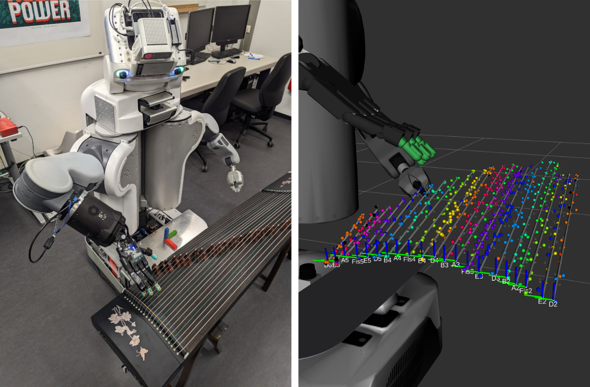

# Chordophone Exploration

## Contents

This repository is associated with a submitted manuscript and will be populated upon publication.

## Errata

### IV-H

$$s.t. \mathcal{V}(s,\phi) > 1 - \alpha$$
should read
$$s.t. \mathcal{V}(s,\phi) > \alpha$$
for consistency with section III and for interpreting chosen values of $\alpha$.
